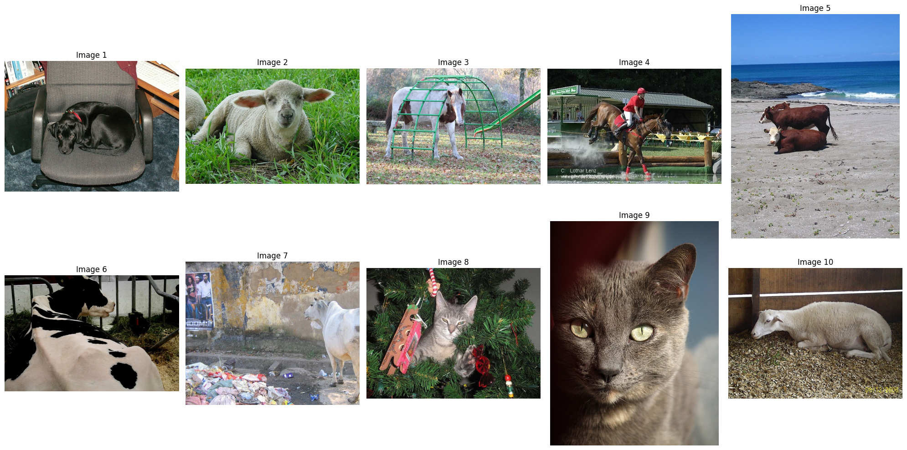
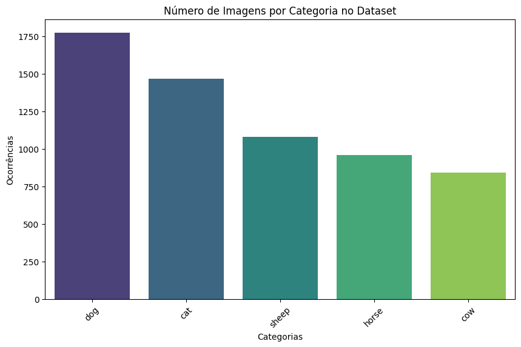
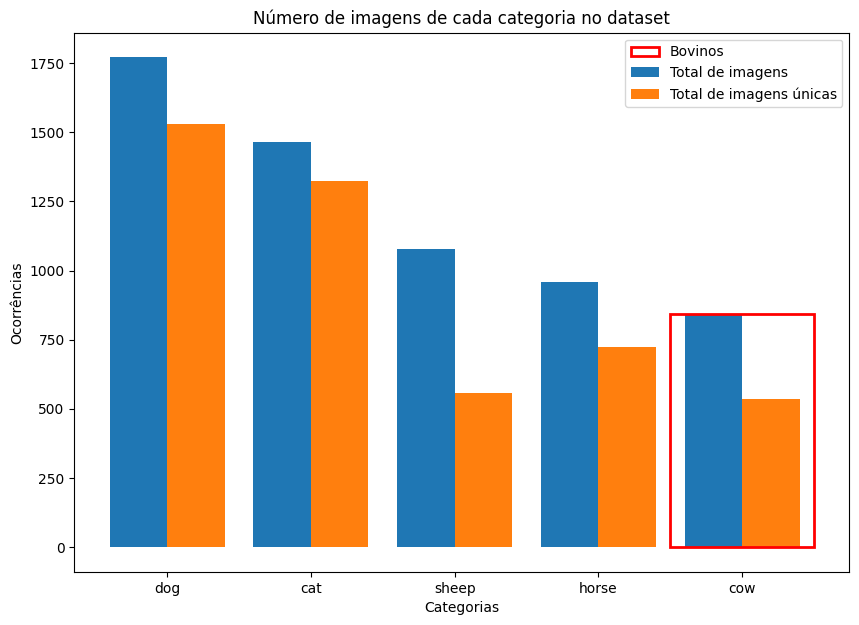
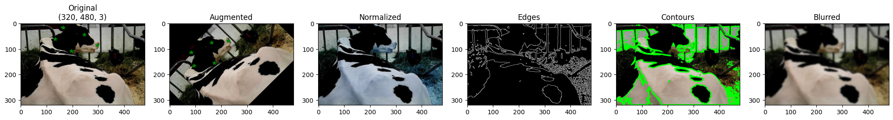
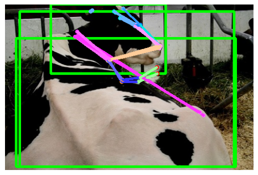
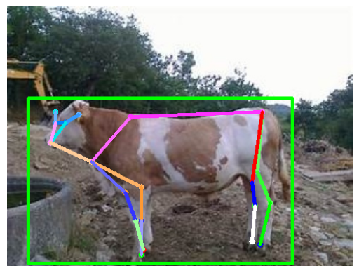
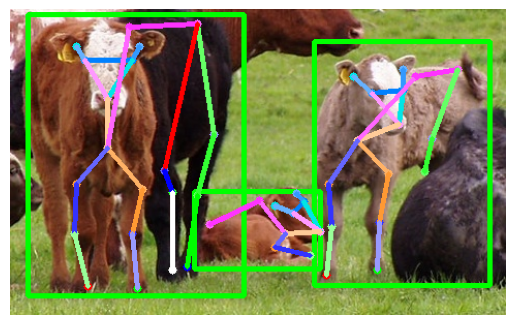

# Ponderada Animal Pose

## Introdução
Este projeto implementa a estimativa de pose para bovinos utilizando o dataset ANIMAL-POSE. O objetivo é identificar e localizar pontos chave no corpo dos bovinos nas imagens do dataset.

## 1. Análise Exploratória

### Dataset
O dataset ANIMAL-POSE pode ser obtido [aqui](https://sites.google.com/view/animal-pose/).

### Análise Exploratória
A análise exploratória foi realizada para entender a distribuição das categorias no dataset e visualizar algumas imagens de amostra. Foram encontradas X imagens de bovinos.

#### Visualização de Imagens
Foram visualizadas as 10 primeiras imagens do dataset para uma inspeção inicial:

#### Distribuição das Categorias
A contagem das ocorrências de cada categoria foi plotada, destacando a quantidade de imagens de bovinos:

Total de imagens de bovinos: **X**

## 2. Filtragem e Processamento de Imagens de Bovinos

### Filtragem
O dataset foi filtrado para manter apenas as imagens de bovinos. O processo de filtragem envolveu a seleção das anotações correspondentes à categoria de bovinos e a separação dessas imagens.

### Processamento de Imagens
As imagens de bovinos foram processadas para realizar a estimativa de pose. A figura a seguir ilustra o processo de filtragem e processamento:

#### Exemplo de Processamento
1. Carregamento da imagem
2. Identificação dos pontos chave
3. Visualização da pose estimada

## 3. Resultados Finais

### Predição de Pose
A predição da pose foi realizada em várias imagens de bovinos. A seguir, são apresentados alguns resultados de predição:

## 4. Conclusões Pessoais

### Aprendizados
Durante a implementação deste projeto, alguns dos principais aprendizados foram:

- A importância da análise exploratória para entender a composição do dataset.
- Os desafios na filtragem e pré-processamento de imagens para tarefas específicas.
- A necessidade de ajustes finos em imagens por contas de semelhanças entre diferentes animais, tornadno uma tarefa difícil definir os pontos chaves.

### Limitações
Algumas das limitações do trabalho incluem:

- Qualidade variada das imagens no dataset, afetando a precisão da estimativa de pose.
- Limitações do modelo utilizado em reconhecer poses em diferentes condições de iluminação e ângulos de câmera.

### Trabalhos Futuros
Para trabalhos futuros:

- Aumentar a diversidade e qualidade das imagens no dataset.
- Explorar modelos mais avançados e técnicas de data augmentation para melhorar a precisão.
- Implementar um pipeline automatizado para a estimativa de pose em tempo real.
- Testar com mais técincas de data augmentation e de melhoria que estudamos surante o módulo.
- Talvez definir um pouco melhor os box de referência.

---

Este projeto foi desenvolvido por Luiz Carlos da Silva Júnior, utilizando o dataset ANIMAL-POSE e técnicas de aprendizado profundo para a estimativa de pose em bovinos.
